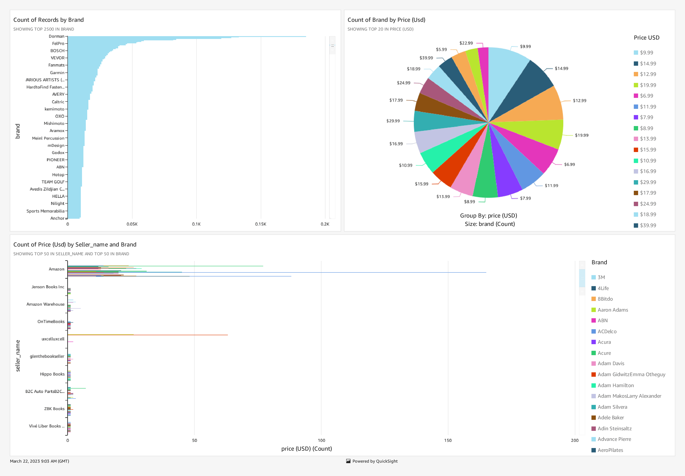

# AWS QuickSight Project

[](https://github.com/DanieleBocchino/AWS-quicksight-project)
[](https://github.com/DanieleBocchino/AWS-quicksight-project)
[](https://github.com/DanieleBocchino/AWS-quicksight-project)
[](https://github.com/DanieleBocchino/AWS-quicksight-project)
[](https://github.com/DanieleBocchino/AWS-quicksight-project)

This is a mini project created using AWS Services - Amazon S3 and Amazon Quicksight. This project aims to provide instructions on how to use AWS services to create visualizations from large datasets. 

[](https://docs.aws.amazon.com/quicksight/latest/user/signing-up.html)
[](https://aws.amazon.com/s3/)
[](https://aws.amazon.com/quicksight/)

## Table of Contents

- [Introduction](#introduction)
- [Project Overview](#projectoverview)
- [Data Source](#datascource)
- [Resources](#resources)
- [Usage](#usage)
- [Conclusion](#conclusion)
- [License & Credits](#license&credits)
- [Contributors](#contributors)

## Introduction

This project was created as part of a tutorial by [Tech with Lucy](https://www.youtube.com/c/techwithlucy). The [tutorial](https://www.youtube.com/watch?v=4-8cXuZzKTg&list=PLWBfjpfzscb7rCHCeZHZgm5PgifCZdr1M&index=4), provided a step-by-step guide on how to use Quicksight for data visualization and analysis. Quicksight is an Amazon Web Services (AWS) tool that allows users to create interactive dashboards and reports using their own data. By following the tutorial, I was able to learn how to use Quicksight to create engaging visualizations and gain valuable insights from my data.

## Project Overview

The project involves the following steps:

- Download a dataset of 50,000 best-selling Amazon products from GitHub.
- Store the dataset into an Amazon S3 bucket.
- Connect the S3 bucket with Amazon Quicksight to create a few interesting visualizations.

## Data Source

The dataset used in this project is a subset of data from a huge dataset that was provided by Bright Data. Bright Data is a leading data collection company that collects public web data at scale. They provide web scripting tools in their IDE as well as ready-to-use datasets. In this project, the dataset provided by Bright Data includes a list of the Amazon bestseller products.

### Resources

The following resources were used in the development of this project:

-  Amazon S3
-  Amazon QuickSight

## Usage

To get started with this project, please follow the steps listed below:

1. Clone this repository.
2. Download the CSV file named "amazonbestseller.csv" and the JSON file named "manifest.json" from the GitHub page.
3. Head over to the AWS Management Console and create an S3 bucket.
4. Upload the CSV file to the S3 bucket.
5. Open the manifest.json file and make the necessary changes to the file as mentioned in the video.
6. Connect the S3 bucket with Amazon Quicksight to create visualizations.

### Step 1: Clone this repository

```
git clone https://github.com/DanieleBocchino/AWS-quicksight-project.git
```

### Step 2: Download the CSV file and the JSON file

Download the CSV file named [Amazon-Bestseller-Dataset.csv](Amazon-Bestseller-Dataset.csv) and the JSON file named [manifest.json ](manifest.json) from the GitHub page.

### Step 3: Create an S3 bucket

Head over to the AWS Management Console and create an S3 bucket.

### Step 4: Upload the CSV file to the S3 bucket

Upload the CSV file to the S3 bucket.


### Step 5: Make the necessary changes to the manifest.json file

Open the manifest.json file and make the necessary changes to the file as mentioned in the video.


### Step 6: Connect the S3 bucket with Amazon Quicksight to create visualizations

Connect the S3 bucket with Amazon Quicksight to create visualizations.

## Conclusion

This project provides hands-on experience in using AWS services to create visualizations from large datasets. By following the instructions provided, you can learn how to use Amazon S3 and Amazon Quicksight to create compelling visualizations. Feel free to customize the project to your liking and experiment with different datasets to gain more insights.


## License & Credits
This project is based on the tutorial [Build Interactive Dashboards with Amazon QuickSight](https://www.youtube.com/watch?v=4-8cXuZzKTg&list=PLWBfjpfzscb7rCHCeZHZgm5PgifCZdr1M&index=4) by [Bright Data](https://www.youtube.com/channel/UCZ9Q6iOJgY1v9QYqJwQvE5A). 

[](https://opensource.org/license/mit/)


## Contributors

[Daniele Bocchino](https://danielebocchino.github.io/)

[](https://github.com/DanieleBocchino)  
[](https://www.linkedin.com/in/daniele-bocchino-aa602a20b/)


